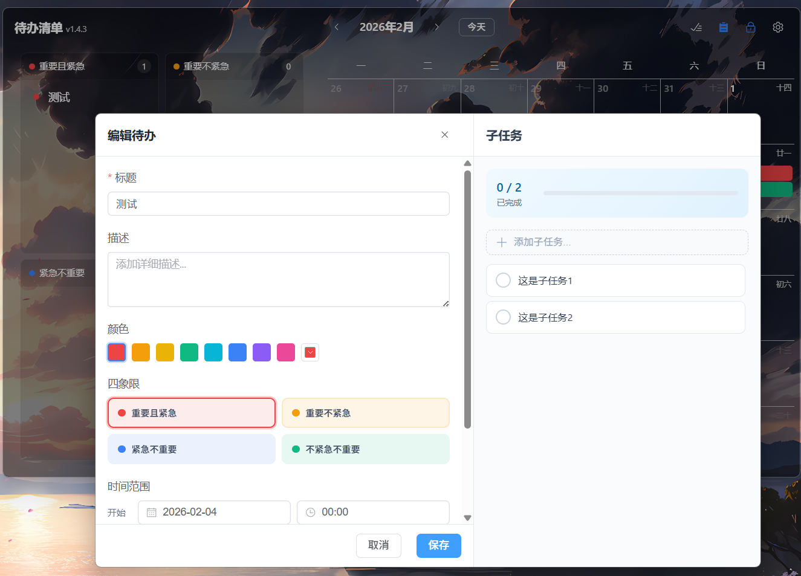

# Mini Todo

一款简洁高效的跨平台桌面待办事项管理应用，基于 Tauri 2 + Vue 3 + TypeScript 开发，支持 Windows / macOS。




## 功能特性

### 待办管理
- 以列表模式/四象限模式展示待办项（支持子任务）
- 子任务支持标题 + 内容分离，内容使用 Markdown 编辑器（Milkdown）
- 子任务支持粘贴/拖拽上传图片，图片点击可预览
- 子任务列表双击可快捷内联编辑标题
- 支持日历展示，以及自定义颜色
- 列表/四象限模式都拖拽排序
- 系统提醒

### 云同步（WebDAV）
- 支持通过 WebDAV 协议进行云端数据同步（兼容坚果云、NextCloud 等）
- 同步数据包含待办事项、子任务及图片
- 支持定时自动同步 + 手动一键同步
- 同步数据采用 Gzip 压缩，减少网络传输体积
- 冲突检测与解决：当本地和远端同时修改时，用户可选择保留版本

### 日历模式
- 月视图日历
- 支持农历与法定节假日显示
- 支持调休上班日标记（节假日数据源）

#### 数据来源
- 法定节假日与调休上班日：NateScarlet/holiday-cn（Tauri 后端拉取 JSON）
  - https://raw.githubusercontent.com/NateScarlet/holiday-cn/master/{year}.json
- 农历/节气/传统节日：lunar-javascript
  - https://github.com/6tail/lunar-javascript

### 窗口特殊功能
- **普通模式**：浅色主题，可拖拽移动、调整大小
- **固定模式**：
  - 透明背景，融入桌面
  - macOS 下启用原生毛玻璃（Vibrancy）效果
  - 忽略 Win+D（显示桌面，存在bug，触发后需要点击任意一个窗口，才会出来）
- 固定模式背景样式暂不支持自定义配置
- 多屏幕位置记忆（重启后根据显示器配置，保持窗口位置）

### 系统功能
- 系统托盘图标（支持双击快速添加待办项）
- 开机自启动
- 版本更新检查
- 数据导入/导出
- WebDAV 云同步配置（设置页面内集成）

### 补充
- 因为我没有MacOS和Linux桌面，所以大概率上会存在效果偏差
- 如有相关电脑也愿意进行维护的，欢迎提交PR

## 安装

前往 [Releases](https://github.com/dreamlonglll/mini-todo/releases) 页面下载最新版本。

### Windows
- 下载 `.msi` 或 `.exe` 安装包
- 运行安装程序完成安装
  

## 开发

### 环境要求
- Node.js 18+
- Rust 1.70+
- Windows 10/11 或 macOS

### 安装依赖

```bash
# 安装前端依赖
npm install
```

### 开发模式

```bash
npm run tauri dev
```

### 构建生产版本

```bash
npm run tauri build
```

## 技术栈

| 层级 | 技术选型 | 说明 |
|------|----------|------|
| 前端框架 | Vue 3 + TypeScript | 组合式 API，类型安全 |
| UI 组件库 | Element Plus | 企业级 UI 组件库 |
| Markdown 编辑器 | Milkdown | 基于 ProseMirror 的插件化 WYSIWYG 编辑器 |
| 状态管理 | Pinia | Vue 官方推荐状态管理 |
| 桌面框架 | Tauri 2.x | 轻量级跨平台桌面框架 |
| 后端语言 | Rust | 高性能，内存安全 |
| 数据库 | SQLite | 轻量级本地数据库 |
| 云同步协议 | WebDAV | 兼容坚果云、NextCloud 等 |

## 项目结构

```
mini-todo/
├── src/                     # Vue 前端源码
│   ├── components/          # Vue 组件
│   ├── stores/              # Pinia 状态管理
│   ├── types/               # TypeScript 类型定义
│   ├── views/               # 页面视图
│   └── styles/              # 样式文件
├── src-tauri/               # Tauri/Rust 后端源码
│   ├── src/
│   │   ├── commands/        # Tauri 命令
│   │   ├── db/              # 数据库操作
│   │   └── services/        # 服务模块
│   └── tauri.conf.json      # Tauri 配置
└── docs/                    # 文档
```

## 许可证

MIT License

## 致谢

- [Tauri](https://tauri.app/) - 构建更小、更快、更安全的桌面应用
- [Vue.js](https://vuejs.org/) - 渐进式 JavaScript 框架
- [Element Plus](https://element-plus.org/) - Vue 3 组件库
- [Milkdown](https://milkdown.dev/) - 插件化 Markdown 编辑器
- [lunar-javascript](https://github.com/6tail/lunar-javascript) - 农历/节气计算
- [NateScarlet/holiday-cn](https://github.com/NateScarlet/holiday-cn) - 中国法定节假日数据
